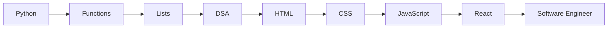

<h1 align="center">Hi 👋, I'm Shivam Yadav</h1>

<p align="center">
  
</p>

<p align="center">
  
</p>

---

# 🚀 Developer Dashboard

```bash
> booting profile...
> loading skills...
> loading projects...
> loading future software engineer...
> system ready ✓
```

## 🧠 About Me

* 🎓 Computer Science Engineering Student
* 🐍 Currently Learning Python
* 📚 Learning DSA & Problem Solving
* 🌐 Exploring Web Development
* 🚀 Building Projects & Growing Daily
* 🎯 Goal: Become a Software Engineer

---

## ⚡ Current Mission

```text
Python Fundamentals      ██████████ 100%
Loops & Logic            ███████░░░ 70%
Functions                ███░░░░░░░ 30%
DSA                      ██░░░░░░░░ 20%
Web Development          ░░░░░░░░░░ 0%
Open Source              ░░░░░░░░░░ 0%
```

---

## 🛠 Tech Arsenal

### Languages


### Frontend


### Tools


---

# 📊 Analytics Command Center

<p align="center">


</p>

<p align="center">

</p>

---

# 🏆 GitHub Trophies

<p align="center">

</p>

---

# 🌱 Learning Roadmap



---

# 🚀 Featured Projects

### 🌐 Portfolio Website

Modern animated portfolio built with HTML, CSS and JavaScript.

### 💰 Expense Tracker

Track income and expenses efficiently.

### 🎓 Student Management System

Manage student records and reports.

### 📚 CDS Study Tracker

Track CDS preparation and progress.

### 🤖 Future AI Projects

Coming Soon...

---

# 📈 Contribution Graph


---

# 🐍 Contribution Snake


---

# 💭 Developer Philosophy

> "Small progress every day beats talent that never practices."

---

# 🌐 Connect With Me

<p align="center">
<a href="https://github.com/YOUR_USERNAME">GitHub</a> •
<a href="https://linkedin.com/in/YOUR_LINKEDIN">LinkedIn</a> •
<a href="mailto:YOUR_EMAIL">Email</a>
</p>

---

<h3 align="center">
⚡ Building one project at a time ⚡
</h3>
